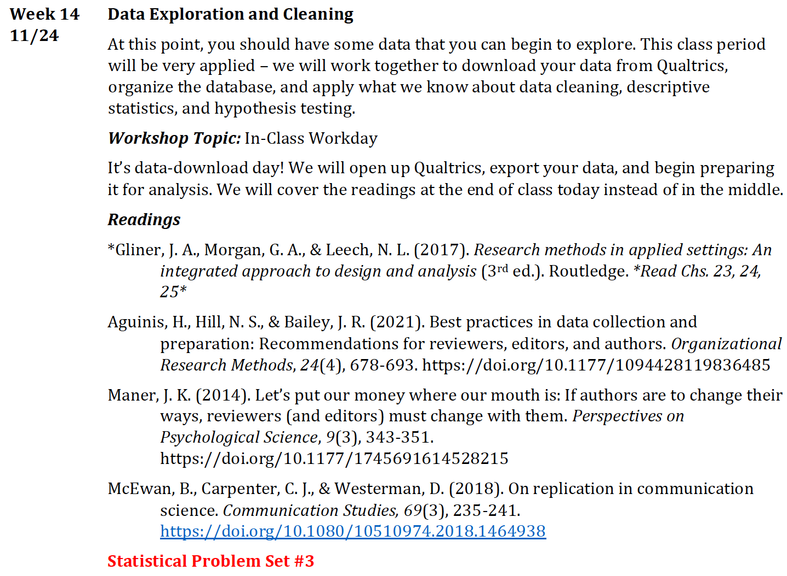

# Housekeeping

## Overview

-   Housekeeping
-   Getting Data from Qualtrics
-   Cleaning!
-   SPS #3

## Project Timeline {.smaller}

-   Only 3 weeks left! All surveys have launched.
-   Final Report must include:
    -   APA format
    -   Introduction, Rationalize, Lit Review, RQs/Hs, Methods, Results, Discussion (Implications, Limitations, Future Research), Conclusion, References, Any Relevant Appendices
-   Final Conference-Style Presentation must include:
    -   Visual aid
    -   15 minute max
    -   Each member should speak
    -   Brief Q&A at the end

## Help Sessions This Week

{fig-align="center"}

## What's Next?

{fig-align="center"}

## Where we're at

:::::::: panel-tabset
### Team Vax

N = 391

::: {layout-ncol="2"}
.jpeg){fig-align="left"}

.jpeg){fig-align="left"}

:::

### Team Binge

N = 182

::: {layout-ncol="2"}
.jpeg){fig-align="left"}

{fig-align="left"}
:::

### Team Snowstorm

LAUNCHED

::: {layout-ncol="2"}
.jpeg){fig-align="left"}

.jpeg){fig-align="left"}

:::

### Team PvP

N = 114

::: {layout-ncol="2"}
.jpeg){fig-align="left"}

.jpeg){fig-align="left"}

:::

### Team Friendship

N = 90

::: {layout-ncol="2"}
.jpeg){fig-align="left"}

.jpeg){fig-align="left"}

:::
::::::::

## Your Task?

-   Download and clean your data
-   Run your tests (time permitting)

# Downloading your data from Qualtrics

## Data & Analysis

{fig-align="center"}

## Export & Import

{fig-align="center"}

## Export Data

{fig-align="center"}

## Download SPSS File

{fig-align="center"}

## Experimental Conditions

{fig-align="center"}

# Wrap Up!

## Remember!

Good researchers **support** and **justify** they decisions they made along the way.

## What's Next??

You have successfully put together a quantitative research study. The next step is to present this work to your peers at an academic conference. The content for the final week in the course centers on effective dissemination and presentation of your empirical results. You should leave the day feeling prepared for your final course presentations, as well as any conference presentations you plan to submit to in the future.
