# Housekeeping

## Overview

-   Housekeeping
-   Mild Review
-   Dissemination and Presentation
-   How to do a Peer Review
-   Polishing

## Project Timeline 

::: r-fit-text

-   Regarding *analysis*, you are responsible for:
    -   Missing data, Means, SDs, Reliabilities (alphas or omegas), analysis
-   Final Report must include:
    -   APA format; Introduction, Rationalize, Lit Review, RQs/Hs, Methods, Results, Discussion (Implications, Limitations, Future Research), Conclusion, References, Relevant Appendices
-   Final Conference-Style Presentation must include:
    -   Visual aid
    -   15 minute max; Each member should speak
    -   Brief Q&A at the end
-   **December 15 / 5:00 pm / My house**
    -   Address sent via email
    -   City BBQ; Let me know about allergies!

:::

## What's Next?

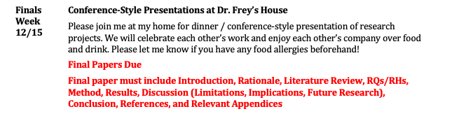{fig-align="center"}

## Help Sessions This Week

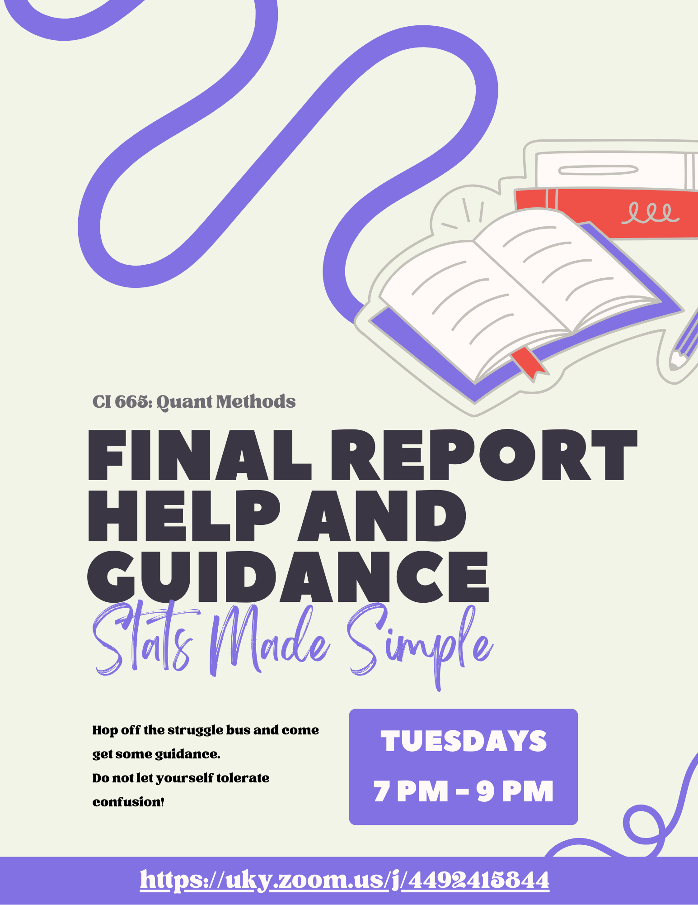{fig-align="center"}

# Quick Review

## Whats. That. Analysis???

::: panel-tabset
### PvP

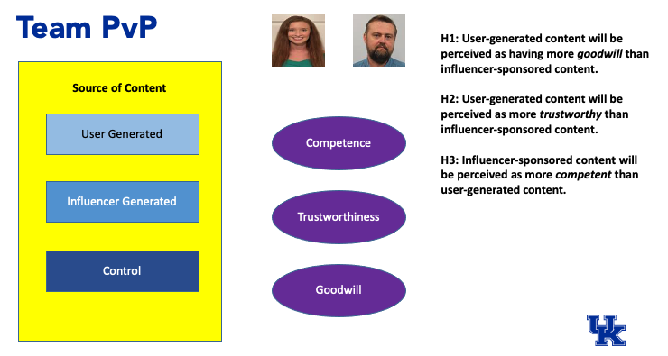{fig-align="center" width="800"}

### Binge

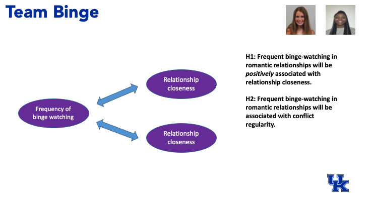{fig-align="center" width="600"}

### Snowstorm

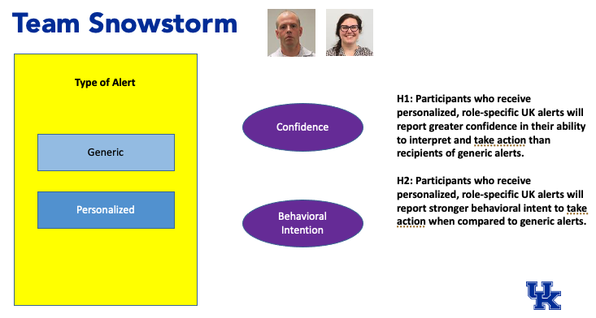{fig-align="center"}

### Friendship

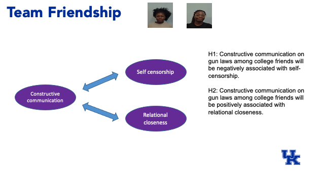{fig-align="center"}

### Vax

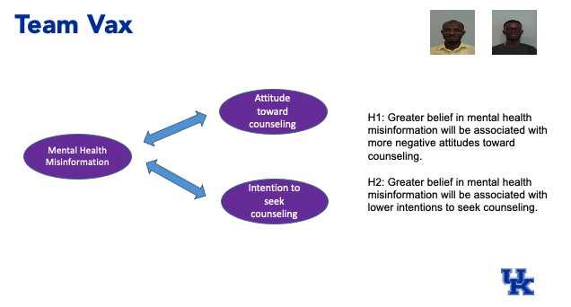{fig-align="center"}
:::

# Donuts and Details!

*One Scholar's Approach to Scientific Communication*

## 2 Goals

**Defining the Donut**

-   Defining your objective and actively preparing

**Presenting as Performance**

-   Developing your identity as a speaker and handling Q&A

## Situating the Talk

"According to most studies, people's number one fear is public speaking. Number two is death. Death is number two? Does that seem right? To the average person that means that if they have to go to a funeral, they'd be better off in the casket than giving the eulogy."

-   Jerry Seinfeld

## Planning Your Story {.smaller}

::::: columns
::: {.column width="50%"}
**Step 1: Consider the donut**

If the donut is your field, the hole is the gap you're trying to fill.

-   Your research question(s)
-   Motivate audience to listen
-   *Focus on what we do not know*
:::

::: {.column width="50%"}
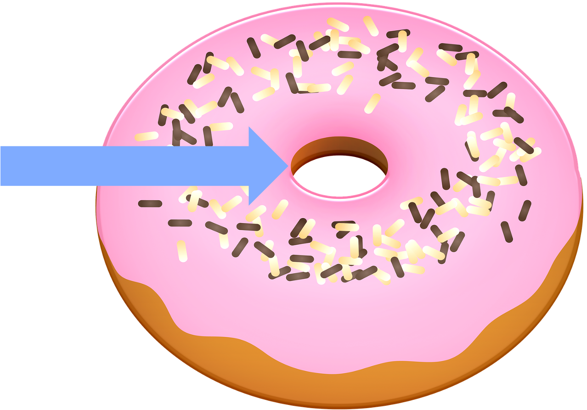{.absolute top="205" left="585" width="400"}
:::
:::::

## Planning Your Story {.smaller}

::::: columns
::: {.column width="50%"}
**Step 2: Analyze your audience**

Consider the following questions:

-   What do they already know?
-   Are they required to be here?
-   What do we have in common?
-   What do they want to know
:::

::: {.column width="50%"}
**Step 3: Identify your throughline**

What is the invisible thread that binds your story together?

-   The scientific method
-   A central question
-   An area of study
-   A conference theme?
:::
:::::

## Planning Your Story {.smaller}

::::: columns
::: {.column width="50%"}
**Step 4: Analyze Your audience**

Use *analogies* and little jargon

-   After assessing your audience and identifying your throughline, you can choose language that is appropriate.
-   Avoid specialized language and use terms that are familiar.
:::

::: {.column width="50%"}
**Step 5: End with a clear conclusion**

You should always:

-   Identify what we know now that we did not know before.
-   Articulate where the research goes next.
-   Make it memorable!
:::
:::::

## Complex Topics

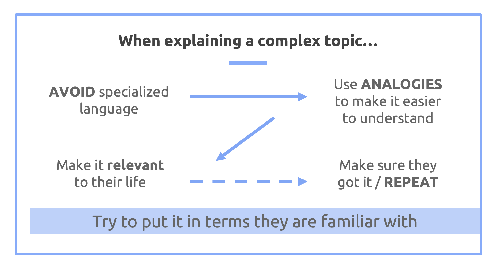{fig-align="center"}

## You Try

Think of a research project or topic you are interested in.

**How would you explain this to a group of 2 to 4 year olds?**

## Quantum Physics...for babies?

Chris Ferrie - PhD in Applied Mathematics

Topics range across:

-   General relatively
-   Bayesian statistics
-   Electromagnetism
-   Robotics
-   Neural networks

## Baby University

What specific strategies do the books take to explain their subject matter?

Are they effective? Why or why not?

## The Hourglass

::::: columns
::: {.column width="50%"}
-   Tell them what you're going to tell them...
-   Tell them...
-   Tell them what you told them...
:::

::: {.column width="50%"}
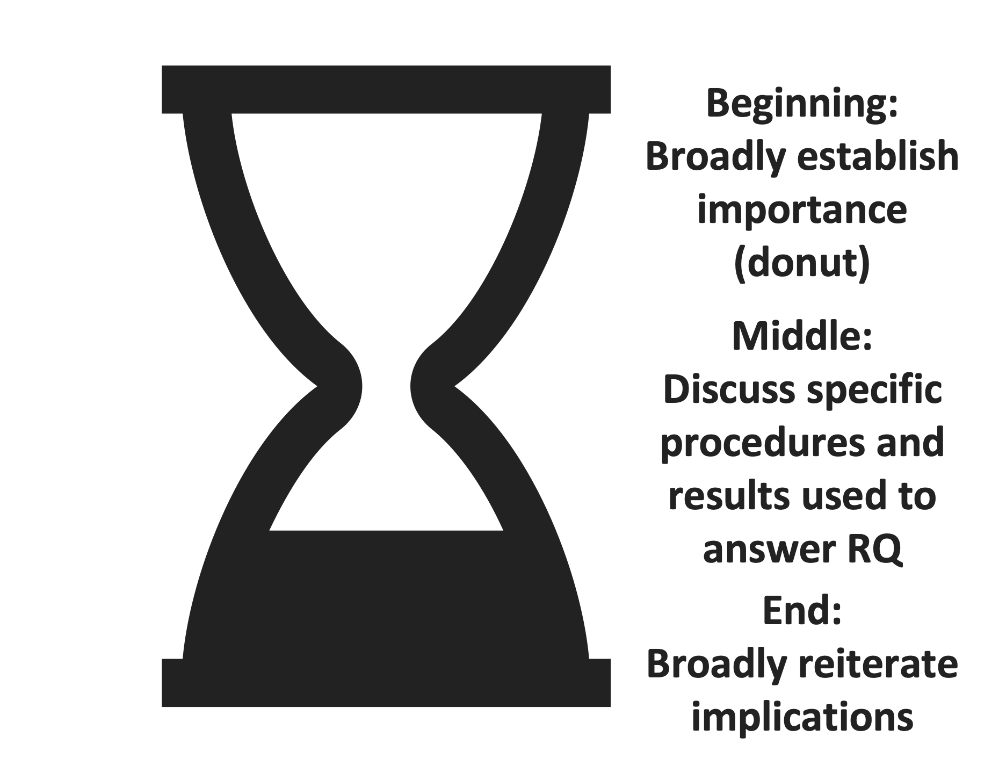{.absolute top="70" left="440" width="600"}
:::
:::::

## What's Missing?? {.smaller}

::::: columns
::: {.column width="50%"}
BE **SELECTIVE** in your details.

-   Highlight critical information
-   Avoid overwhelming listeners
-   Keep literature review to a minimum
:::

::: {.column width="50%"}
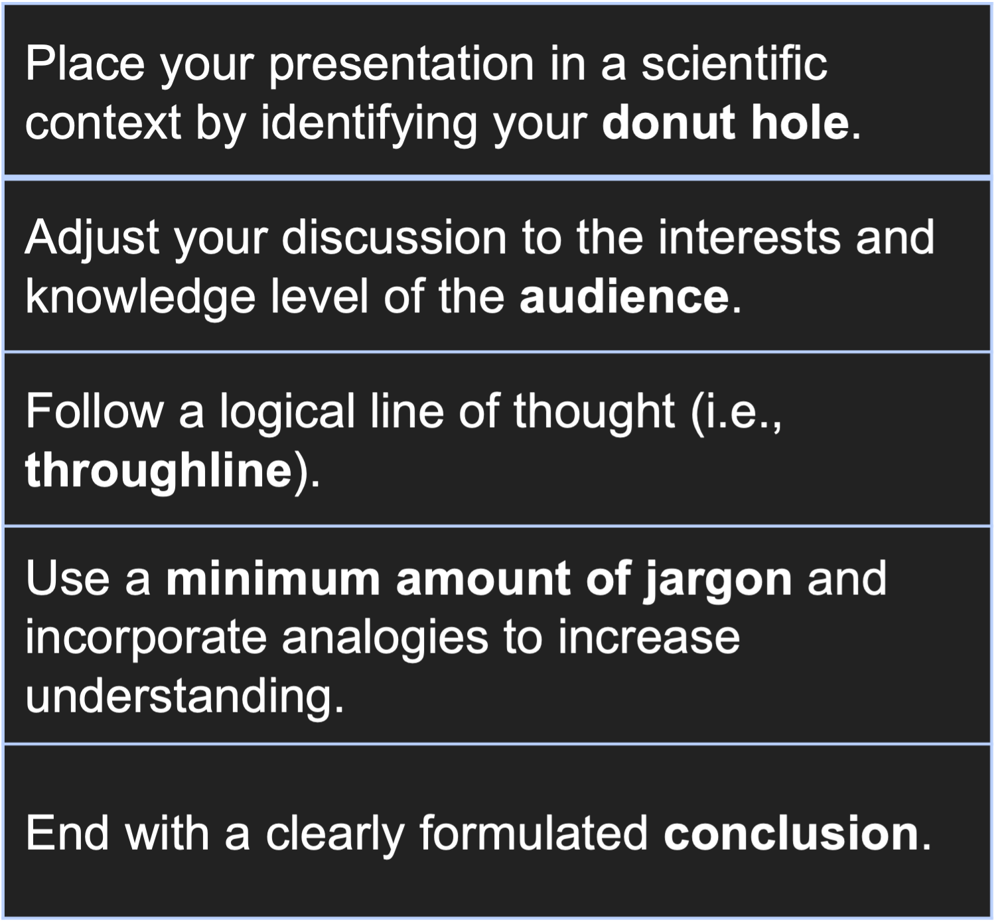{.absolute top="115" left="550" width="500"}
:::
:::::

## An Example Donut

https://tkodyfrey.github.io/ResearchOverview

# Presenting as *Performance*

Developing your identity as a speaker

## Roots in identity

View your talk as a performance of your identity.

It takes time, preparation, and practice to *convey the image you want* to the audience.

## Delivery

Remember that *energy does not equal* effectiveness.

-   Match your nonverbals to your tone.
-   Make eye contact with both sides of the room.
-   Stand to engage the audience.
-   Avoid self-handicapping.
-   Practice with keywords.
-   Take a chance!

## Delivery

The audience does not want to be bored.

Engage by utilizing *immediacy* and *speaking to them directly*

This grants you more leniency for mistakes.

## Visual Aids

The visual aid complements your presentation.

-   Avoid trying to do too much.
-   Remain consistent in structure and design.
-   Try to avoid skipping slides.
-   Use it to define complex ideas.
-   Show, don't tell.
-   Put the most important info in the top left.

## Visual Aids

The slides give the audience context.

If you want them to pay attention to you, only use images.

## The 7 Deadly Sins

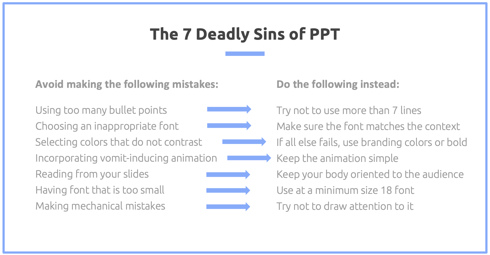{fig-align="center"}

## UK Branding

UKY has a variety of professional, branded materials appropriate for your talks:

<https://www.uky.edu/prmarketing/branding-resources/brand-assets>

## Header

::::: columns
::: {.column width="50%"}
*Content* to support your talk goes here
:::

::: {.column width="50%"}
*Visual* goes here (image, graph, table, chart, etc.)
:::
:::::

## The Hourglass

::::: columns
::: {.column width="50%"}
-   Tell them what you're going to tell them...
-   Tell them...
-   Tell them what you told them...
:::

::: {.column width="50%"}
{.absolute top="70" left="550" width="500"}
:::
:::::

## Scenes in a story {.smaller}

```{mermaid}
%%| fig-width: 10
flowchart LR
    A((Premise))
    B((Core Conflict))
    C((Tension))
    D((Turning Point))
    E((Resolution))
    A-->B
    B-->C
    C-->D
    D-->E
```

-   **Premise**: What is the donut hole?
-   **Core Conflict**: Brief backstory to get audience invested
-   **Tension**: What are the implications?
-   **Turning Point**: How will we follow to relieve the tension?
-   **Resolution**: Resolve the conflict through your *vision*

Your throughline connects the pieces

## And then?

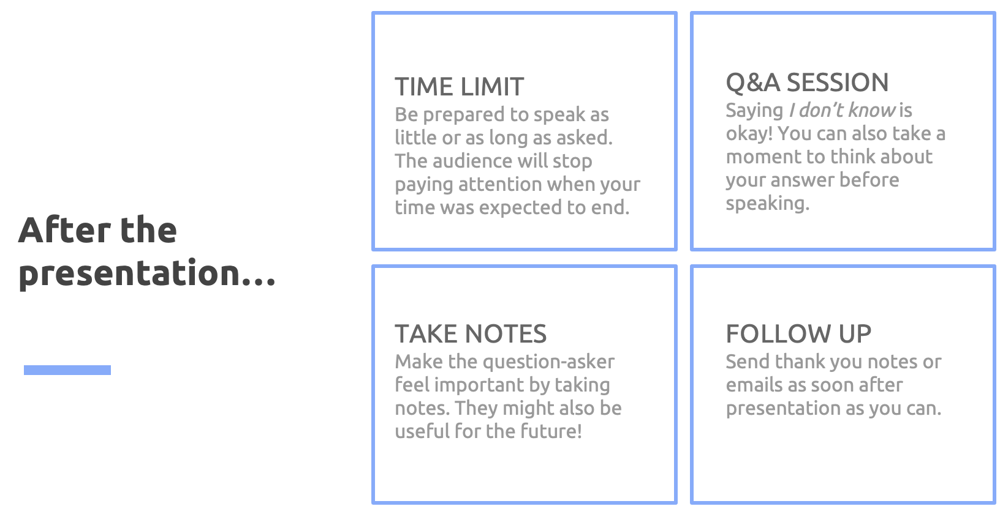{fig-align="center"}

## Recap

::: panel-tabset
### Donuts!

Remember the hole in the field that you are trying to fill.

Adapt the content to the audience.

### Performance

Think about how your presentation reflects the identity you want.

Turn your talk into a *story*
:::

# Speaking is hard.

No one expects you to be perfect right away. Embrace the mistakes because they've happened to everyone.

## The Conscious Competence Model

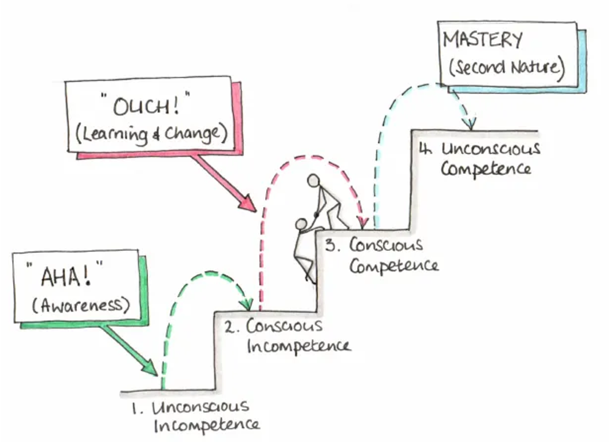{fig-align="center"}

# Peer Review

*Busting the mythology of Reviewer 2*

## Important Considerations {.smaller}

-   It is a privilege to be asked to review - take it seriously!
-   Rely on what you know
-   Rejecting an article is **okay**
    -   It honestly makes the Editor's life easier
    -   Have a good reason for it
-   Rejection is grounded in changes that **cannot** be addressed in a revision
    -   The worst thing for an author to feel that they could have reconciled the feedback

## Example Reviews

-   Revise and Resubmit -\> Rejection
-   Rejection
-   Acceptance

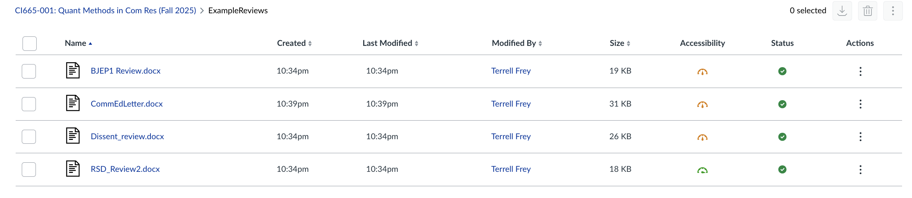{width="400"}

## Tips to be a good reviewer:

-   Use *constructive* and *descriptive* feedback
-   Offer concrete suggestions
-   Acknowledge their work!
-   Provide examples
-   Focus mostly on big pictures issues

## Flip Side: Responding to Reviewers! {.smaller}

-   Be transparent
-   Address ALL concerns
-   Do what they ask unless there is a *really* good reason not to
-   Have citations ready
-   Highlight changes in manuscript AND letter
-   Make them feel appreciated

If you get to this point, it *should* be accepted

## Example Response

This is the *hidden curriculum*. I learned how to do this when I took qualitative methods as a second year PhD student from this same process.

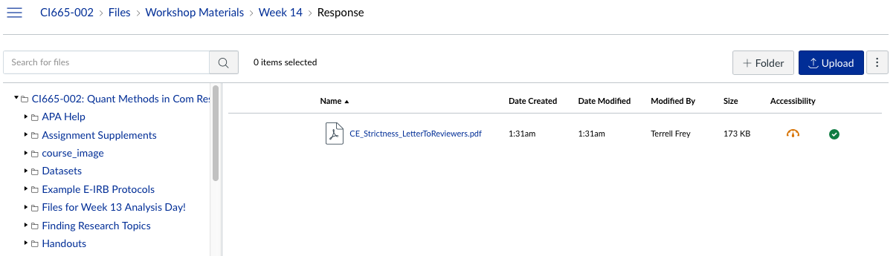{width="400"}

## Memes!

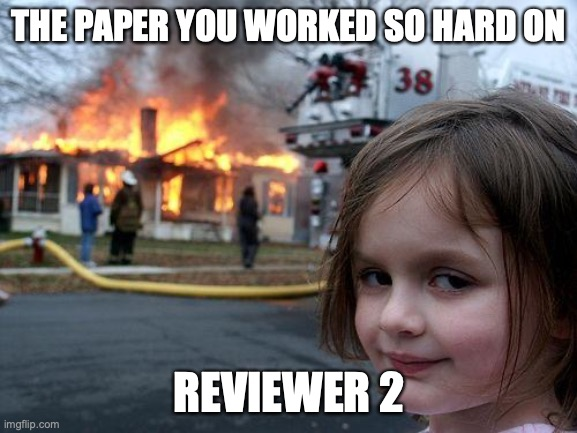{width="400"}

------------------------------------------------------------------------

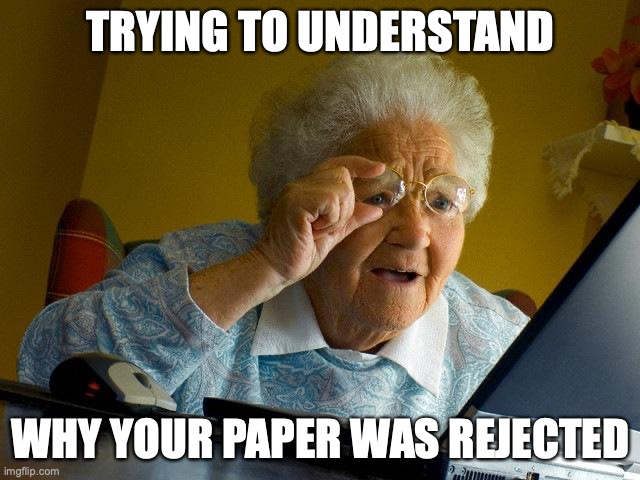{width="400"}

## Remember!

Good researchers **support** and **justify** they decisions they made along the way.

## What's Next??

You have successfully put together a quantitative research study. The next step is to present this work to your peers at an academic conference. The content for the final  in the course centers on effective dissemination and presentation of your empirical results. You should leave the day feeling prepared for your final course presentations, as well as any conference presentations you plan to submit to in the future.
