## Overview {.smaller}

-   Lightning review
-   Measurement Fundamentals
-   Normality, Reliability, and Validity
-   Discussion: Building Meaningful Measures
-   Workshop: Let's Measure
    -   Operationalizing Variables
    -   Applying to your study

## What's Next: Some Changes

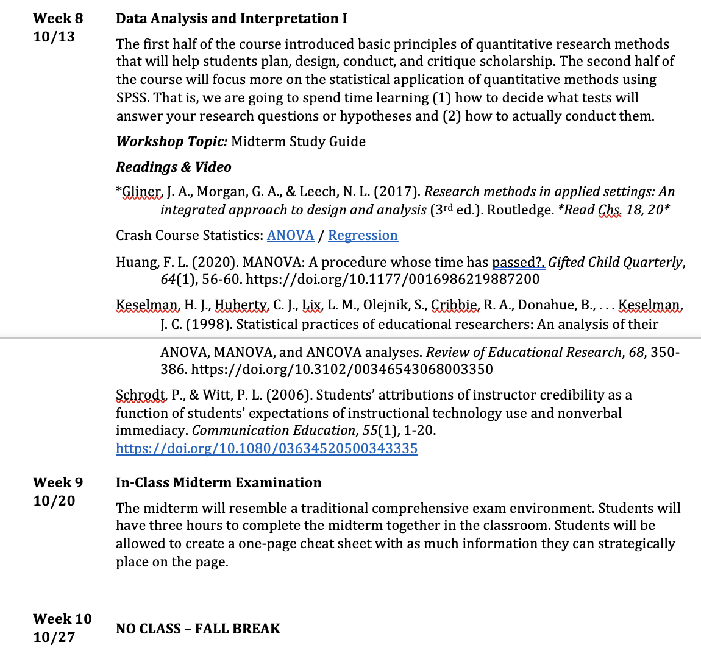{r-fig-align="center"}

# Old Content: Review!

## Internal Validity

### What is it?

. . .

Internal validity is the extent to which we can infer that that IV caused the change in the DV.

Internal validity depends on the strength or soundness of the design and influences whether one can conclude that the independent variable or intervention caused the dependent variable to change

------------------------------------------------------------------------

### Characteristics

**What are the two characteristics used to evaluate internal validity?**

. . .

Internal validity refers to the extent that the independent variable, treatment, or intervention caused the change in the dependent variable. We evaluate it based on...

-   *Equivalence of groups* on participant characteristics
-   *Control of extraneous experiences* and environment variables

------------------------------------------------------------------------

### Threats

**What are the broad threats to internal validity?**

. . .

-   How the research is conducted (e.g., the tools or instruments used)
-   The research participants (e.g., were they randomly assigned)
-   The researchers themselves (e.g., how do independent raters judge behavior)

**Remember the sheet I gave you!**

------------------------------------------------------------------------

### Threats to Equivalence of Groups

::: panel-tabset
### Regression

Measurement is often unreliable. Participants who score low on a measure may score higher (closer to the mean) the next time.

### Attrition

Participants drop out for a number of reasons, but it influences group composition.

### Selection

Problems are created when groups are assigned based on similarities - not randomness.
:::

------------------------------------------------------------------------

### Threats to Control of Extraneous Variables

-   Maturation
-   History
-   Testing
-   Instrumentation
-   Interactive Threats
-   Ambiguous Temporal Precedence (Time)

------------------------------------------------------------------------

### Threats RA does NOT eliminate?

-   People talk
-   Expectation effects (Hawthorne)
-   Observer bias

------------------------------------------------------------------------

## External Validity {.smaller}

. . .

### What is it?

*External validity* is the extent to which samples, settings, and variables can be generalized beyond the study.

------------------------------------------------------------------------

### Sampling Levels

. . .

::: panel-tabset
### Theoretical population

All the participants of theoretical interest to the research and to which he or she would like to generalize.

### Accesible Population

Also called *sampling frame*

The group of participants you actually have access to, perhaps through a list or directory.

### Selected Sample

The smaller group of participants selected from the larger accessible population by the researcher and asked to participate in the study.

### Actual Sample

The participants that complete the study and whose data are actually used in the data analysis and in the report of the study's results.
:::

------------------------------------------------------------------------

### Sampling {.smaller}

**What are the characteristics of a sample frame researchers should evaluate in determining its usefulness?**

. . .

The sampling frame represents an exhaustive list of the participants that a researcher could realistically access for a study.

-   Is the frame representative of the theoretical population?
-   Does the frame include an exhaustive list of potential participants?
-   How was the frame obtained?

------------------------------------------------------------------------

### Ensuring Representativeness

How do we ensure that a sample is representative of the target theoretical population?

. . .

*Random selection* is important for high external validity.

*Random assignment* is important for high internal validity.

------------------------------------------------------------------------

### Types of Sampling

:::: r-fit-text
::: panel-tabset
### Probability Sampling {.smaller}

Everyone has a known, nonzero change of being chosen:

-   Simple Random Sample
-   Systematic Random Sampling
-   Stratified Random Sample
-   Stratified with Diff Probs of Being Selected
-   Cluster (Random) Sampling

### Nonprobability Sampling {.smaller}

No method to estimate probability of being included:

-   Quota Sampling
-   Purposive Sampling
-   Purposeful Sampling
-   Convenience Sampling
-   Snowball Sampling
:::
::::

::: notes
Give them the sampling handout here
:::

------------------------------------------------------------------------

### Types

:::: r-fit-text
**What are the *two* types of external validity**?

*External validity* is the extent to which samples, settings, and variables can be generalized beyond the study.

::: panel-tabset
### Population external validity {.smaller}

-   Was the *sampling frame* representative of the theoretical pop?
-   Was the *selected sample* representative of the population?
-   Was the *actual sample* representative of the population?

### Ecological external validity {.smaller}

Whether the conditions, settings, times, testers, or procedures are rep of natural conditions and so forth and, thus, whether results can be generalized to real life outcomes.

AKA is the research environment similar to the natural environment? Does the manipulation of the IV feel real to the participants?
:::
::::

## Other Types of Validity?

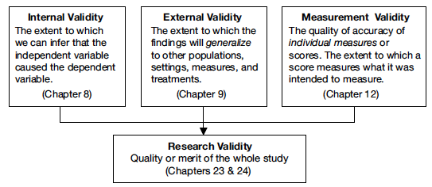

## Key Terms

**What is the difference between a conceptual definition and an operational definition?**

. . .

These are *not* interchangeable

-   **Concept** (Theoretical concept) - a mental representation (more abstract than a construct)
-   **Construct** - a set of operational measures that allow for the study of a theoretical concept (less abstract than a concept)

------------------------------------------------------------------------

## Experiments vs. Surveys {.smaller}

::: panel-tabset
### Experiments

-   *Active* independent variables
-   Tests *causal* relationships
-   Isolates specific relationships between variables of interest
-   Central characteristic is *control*
-   Better suited for theory testing
-   Conclusions better reflect true, meaningful, and observed relationships within a physical, tangible world

### Surveys

-   Non-experimental by nature
-   Relies on attribute independent variables
-   Examines the *presumed* effect of IV on DV
-   Suited to answer questions about preexisting attributes of persons or their ongoing environment that do not change
-   Discovers how larger populations think and act without central component of control
-   Sets the stage for later examining causality
:::

## IVs and DVs

::: r-fit-text
When we discussed the IV, we discussed designing experiments that allow us to *control* the variable of interest.

In other cases, the variables we are interested in might be *continuous*.

This is most often the *dependent* variable (i.e., what is thought to be changed by the IV)
:::

# Measurement: Dependent Variables

## Measurement Theory (Stevens, 1958)

4 levels of measurement used to describe the range and the relationship among the values a variable can take.

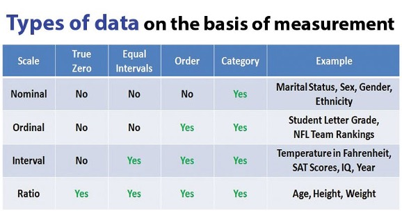{r-fig-align="center"}

------------------------------------------------------------------------

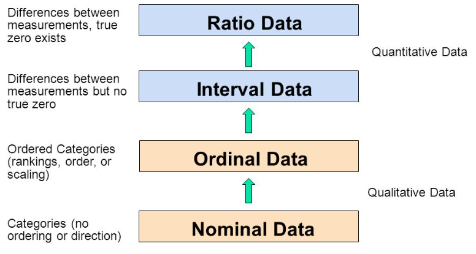{r-fig-align="center"}

## Why is this important?

Depending on the level, the data can mean different things.

For example, the number 2 might indicate a score of two; it might indicate that the participant was a male; or it might indicate that the participant was ranked second in the class.

## Normality

The normal curve provides a model for the fit of the distributions of many of the dependent variables used in the behavioral sciences.

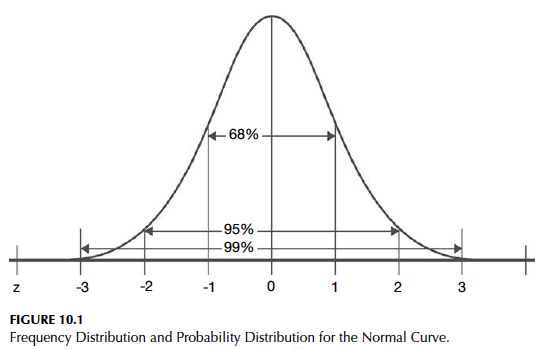{.r-stretch fig-align="center"}

## Definitions

**X axis**: scores or responses on an ordered variable from very low to very high

**Y axis**: number of participants with a particular response

## Applying to the curve

{.r-stretch fig-align="center"}

## More on the Normal Curve

Think of it as a *probability* distribution

What is the probability of a participant's typical response?

If externally valid, should align with probability distribution of the theoretical population.

## Properties {.smaller}

5 properties that are ALWAYS present:

-   Its unimodal
    -   Only has 1 hump in the middle
-   Mean, median, mode are equal
-   Curve is symmetric; it is not skewed
-   Range is infinite
    -   Extremes approach but never touch the x
-   Neither too peaked or too flat
    -   It has no kurtosis
    -   leptokurtic
    -   platokurtic

------------------------------------------------------------------------

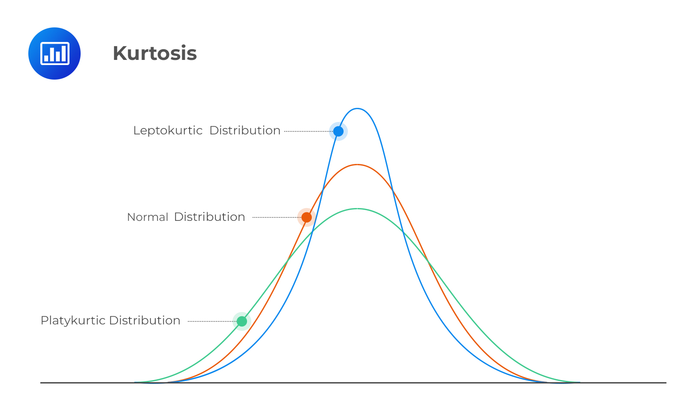{.r-stretch fig-align="center"}

------------------------------------------------------------------------

## Normally distributed variables

Ordered from low to high, responses are at least approximately normally distributed in the population from which the sample as selected

**A number of statistical tests rely on the assumption that the distribution is normal**

## Descriptive Statistics: Central Tendency

:::: r-fit-text
::: panel-tabset
### Mean

-   Sum of raw scores divided by number of observations in the sample
-   Arithmetic average
-   Appropriate for normal data

### Median

-   The mid-point of the raw scores in a sample
-   Appropriate for ordinal or skewed data

### Mode

-   Equal to the raw score that appears most frequently
-   Least precise
-   Useful for nominal or dichotomous data or few categories
:::
::::

## Which do I use?

When data are normally distributed, the mean, median, and mode are all the same and in the center of the distribution.

If data are normal, mean is the stat to use.

## Descriptive Statistics: Variability

Variability describes the spread or dispersion of the scores.

If all scores are the same, there is no variation.

## Application!

In your research, you test to see if an IV can explain the variation in the DV.

Is the IV the reason that the **values of the DV varied from person to person?**

## Descriptive Statistics: Variability

Standard Deviation is the most common. It is a measure of how scores vary about the mean.

Gives you a sense of the spread of the data

-   Are they close to the mean or all apart?
-   How much variability is in the sample?

------------------------------------------------------------------------

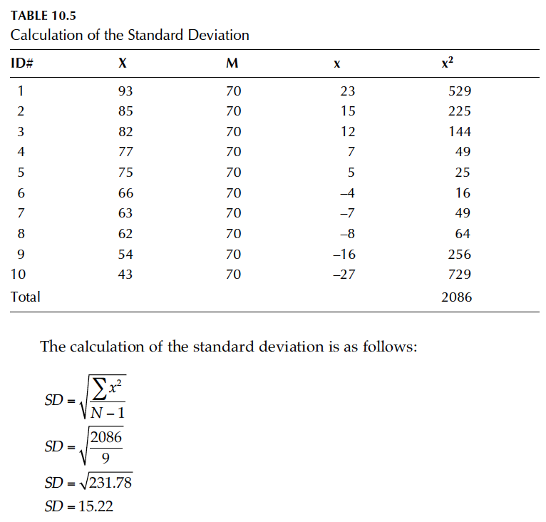{.r-stretch}

------------------------------------------------------------------------

Remember the normal curve?

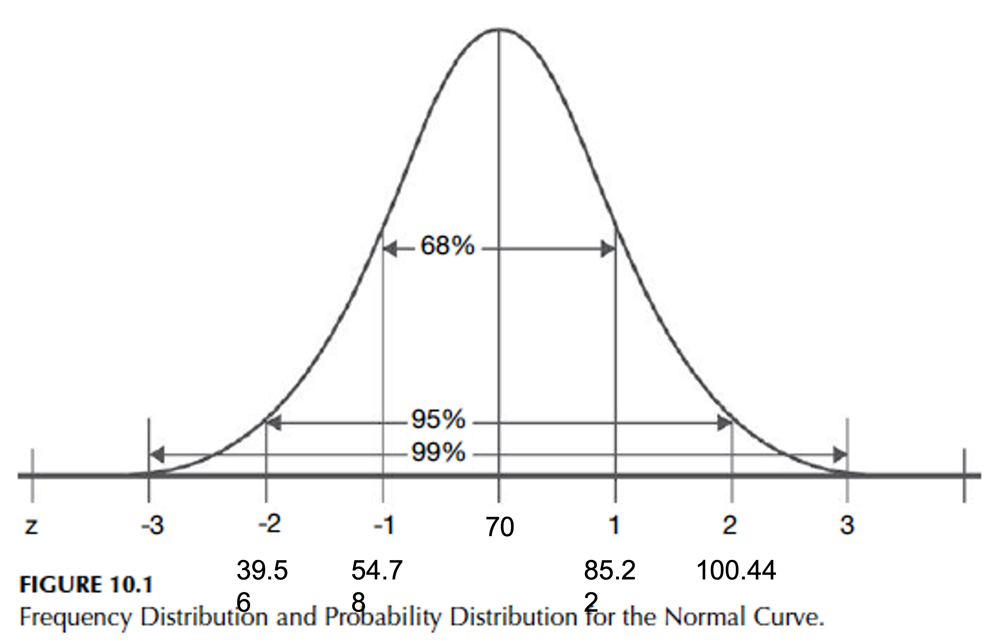{fig-align="center" width="2500"}

If $\overline{x}$ = 70 and s = 15.22

For population: $\mu$ = 70 and $\sigma^2$ = 15.22

## Standardizing the Normal Curve

Can convert a normal curve into a standard curve by setting mean equal to zero and SD equal to 1

Calculated by subtracting the mean from each data point, and then dividing the difference by the standard deviation of the population

Proportions are always the same. This allows comparisons for curves with different means

## Z-Scores

A standard score that indicates the number of standard deviation units that a person's score deviates from the group mean

## An Example {.smaller}

::::: columns
::: {.column width="40%"}
Let's say $\overline{x}$ = 70 and s = 15.22 represent values for student test scores.

-   A student who had 93 on the test would have a z score of **+1.51 (93--70 ÷ 15.22)**
-   A student who scored 43 had a **z of --1.77**.
:::

::: {.column width="60%"}
{fig-align="center"}
:::
:::::

## What makes this useful? {.smaller}

Allows us to **categorize outliers** (if z \> 3.29 or 3 standard deviations)

-   If a variable is perfectly normally distributed, only 0.1% of values fall outside this range.

Allows you to **compare scores** on different tests.

-   Student with an exam score of 80 (in a class whose mean was 70 and **SD was 5**) has a z score of +2.0 and did relatively better than the student (in a class whose mean was 70 and SD was 15.22) who had a test score of 93 and z = 1.51.

------------------------------------------------------------------------

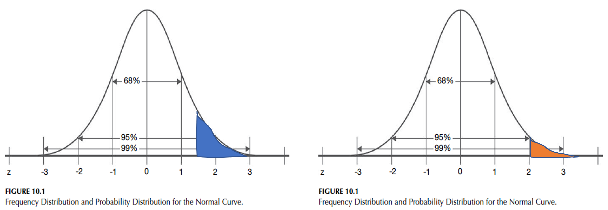{.r-stretch fig-align="center"} 

# GML Chapter 11

Think of a target!

Study quality depends on the *consistency* and accuracy of measurement instruments.

## Measurement Reliability {.smaller}

Think about what it means to be a reliable person.

. . .

Reflects the **consistency of a series of measurements**

Are people responding to a measure consistently over time?

If our outcome measure does not provide reliable data, then we cannot accurately assess the results of our study.

How do we know that a score is due to the intervention or due to some other, unsystematic factor?

## Understanding Reliability

Reliability is a *coefficient*

The ratio of the variance of true scores to the variance of observed scores

The higher the reliability of the data, the closer the true scores will be to observed scores

## Indicating Reliability

::: r-fit-text
Reliability will be displayed as a correlation

This indicates the strength of the relationship between two variables

**A strong positive relationship indicates that people who score high on one test also will score high on a second test.** To say that scores from a measure are reliable, one usually would expect a coefficient between +.7 and +1.0.

Reliabilities will not be negative (or something is wrong)
:::

## Assessing reliability {.smaller}

-   Test retest
-   Parallel forms
-   Split-half
-   KR-20
-   **ALPHA**
-   Percentage agreements
-   ICC
-   Kappa
-   **OMEGA**

## Alpha

$\alpha$

-   Measures **internal consistency**
    -   The consistency of people's responses across the items on a multiple-item measure
    -   Do all items reflect the same underlying construct?
-   Only used when one has multiple items being combined for composite
-   Mean of all possible split-half correlations for a set of items

## Omega

$\omega$

-   Measures **internal consistency** but BETTER
-   Only used when a measure is *unidimensional*
-   The gold standard for reliability of composite scores
-   Alpha depends on a variety of restrictive conditions that Omega bypasses

## Application

An instrument of support was used to measure perceived support from coworkers in a mental health institution. Participants responded to four items on a seven-point Likert-like scale. Cronbach's alpha for the (support) scale was .79. What does this mean?

## Choosing a Measure

-   Past reliability needs to be high
    -   This ensures participants will respond consistently in your study
-   Samples need to be similar

## Why is this important?

If we have less reliable measures, we are less confident that our participants' observed scores are close to their true scores.

## Observed Scores

Any score that we obtain from an individual on an instrument

Observed score = True Score + Error

We cannot know the true score, but we can estimate where it might fall

## Standard Error of Measurement

A range of scores (i.e., confidence interval) within which should lie a performer's true score.

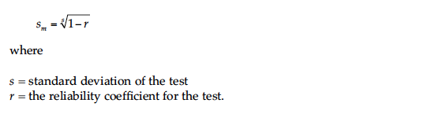{fig-align="center"}

## Establishing Confidence

Most of the time, we want to be 95% sure that we capture the true score (2 standard deviations)

{fig-align="center" width="2500"}

## Putting it together {.smaller}

Lets say we are measuring *satisfaction*

::: panel-tabset
### Calculating SEM

$\sigma^2$ = 15 $\alpha$ = .92 SEM = 4.24

### The Observed Score

Someone completes the combined measures and scores a 110 total

If the instrument has 20 Likert questions ranging from 1 to 7, possible values are 20 to 140.

### Z Scores

The z score for any score that is 2 standard deviations away is 1.96

### Confidence Interval {.smaller}

1.96 \[Z score\] \* 4.24 \[SEM\] = 8.32

We can conclude that our true score falls within the 95 percent confidence interval of 110 ± 8.32 or between **101.68 and 118.32**

If the test were given to the same person a large number of times, 95 percent of the confidence intervals would contain the true score.
:::

## Counter Example {.smaller}

Lets say we are measuring *satisfaction*

::: panel-tabset
### Calculating SEM

$\sigma^2$ = 15 $\alpha$ = .65 SEM = 8.87

### The Observed Score

Someone completes the combined measures and scores a 110 total

If the instrument has 20 Likert questions ranging from 1 to 7, possible values are 20 to 140.

### Z Scores

The z score for any score that is 2 standard deviations away is 1.96

### Confidence Interval {.smaller}

1.96 \[Z score\] \* 8.87 \[SEM\] = 17.39

We can conclude that our true score falls within the 95 percent confidence interval of 110 ± 17.39 or between **92.61 and 127.61**

We are *less precise* in our understanding of how participants are responding
:::

# GML Chapter 12

More targets!

Study quality depends on the consistency and *accuracy* of measurement instruments.

## Measurement Validity

Concerned with *establishing evidence* for the use of a particular measure or instrument in a particular setting with a particular population for a specific purpose.

*accumulating evidence* to provide a sound scientific basis for the proposed score interpretations.

**Are we hitting the target?**

## Differences from Reliability

Reliability is necessary for validity, but one can have consistent data that is not valid.

Suppose I used measurements of your dart throws to indicate your ability to pass this class.

-   If you all hit the target in similar ways, we would have reliability
-   Data is not valid because it is not giving information about ability to pass the course

## Understanding Validity

Validity is tough to establish and takes multiple studies

One type of evidence is insufficient for validity

Often must demonstrate performance of measure in relation to other, similar measures

There is *no statistic* for validity

## Types of Validity {.smaller}

-   Face
-   Content
-   Criterion
    -   Predictive
    -   Concurrent
-   Construct
    -   Convergent
    -   Discriminant
    -   Factorial

## Grit Example

**Predictive**: Do scores on grit predict graduation from West Point?

**Concurrent**: Does grit relate to amount of time studying for a test?

**Convergent**: Is grit related to a measure of a theoretically similar variable (e.g., resilience)

**Divergent**: Is grit different from a theoretically similar variable (e.g., different from coping)

## Establishing Support

The goal should be to build evidence that a measure performs in ways one would expect.

-   Use experts of focus groups to establish that *content* represents concept
-   Establish correlations with other measures we theoretical expect it to
-   Establishing the *nomological network*

## Frey Facts

In general, it is advisable to select instruments that have been used in other studies if they have been shown to produce *reliable* and *valid* data with the types of participants and for the purpose that you have in mind.

## Summary

-   Measurement is complex!
-   Make sacrifices when you choose a specific type of measure
-   Reliability involves the **consistency** of reponses
-   Validity reflects the **accuracy** of responses

# Back to Ch. 13: Data Collection Techniques

What techniques and instruments do we use to collect data?

Major Types of Data Collection Techniques:

-   Researcher observed measures
-   Tests and Documents
-   Self-report measures

## Overview

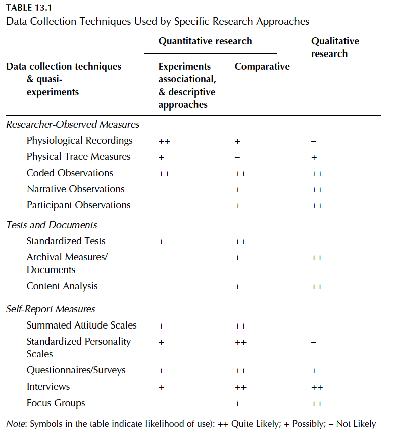{.r-stretch fig-align="center"}

## Researcher Observed Measures

Direct Observation

-   Trains observes to observe and record behaviors of participants in study
-   Differs based on:
    -   Naturalness of the setting
    -   Degree of Observer Participation
    -   Amount of Detail
    -   Breadth of Coverage

## Tests and Documents

A set of problems with right or wrong answers

-   Standardized tests
-   Achievement Tests
-   Performance and Authentic Assessments
-   Aptitude tests
-   Documents

## Self-Report Measures

::::: columns
::: {.column width="30%"}
-   Standardized Personality Inventories
-   Attitude scales
    -   Summated Likert scale
    -   Semantic Differential
:::

::: {.column width="70%"}
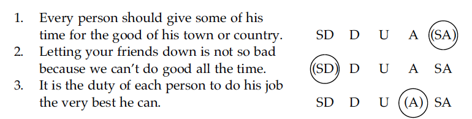{fig-align="center"}
:::
:::::

## Questionnaires and Interviews {.smaller}

Survey research methods!

::: panel-tabset
### Open ended questions

-   Formulate answers in own words
    -   Demanding for participants
    -   Especially useful to build knowledge for closed ended questions!

### Partially open-ended unordered items

-   Give possible answers then have space for response or comments
    -   People usually don't use the spaces or give useful info

### Closed ended unordered items

-   Used when answers to a question fit nominal categories that do not fall on a continuum

### Closed ended questions

-   Ordered choices
    -   Probably what you see most often in measures of attitude
    -   All allowable responses given
:::

------------------------------------------------------------------------

## Frey Facts

In general, it is advisable to select instruments that have been used in other studies if they have been shown to produce *reliable* and *valid* data with the types of participants and for the purpose that you have in mind.

If those aren't available...

## Developing a Measure

Scale development is useful for capturing not directly observable concepts

-   This is what is meant by 'latent'

## Final Thoughts:

**WHY is the measurement theory important in quantitative statistical analysis??**

BOTTOM LINE: Levels of measurement influence the appropriate use of statistics!

------------------------------------------------------------------------

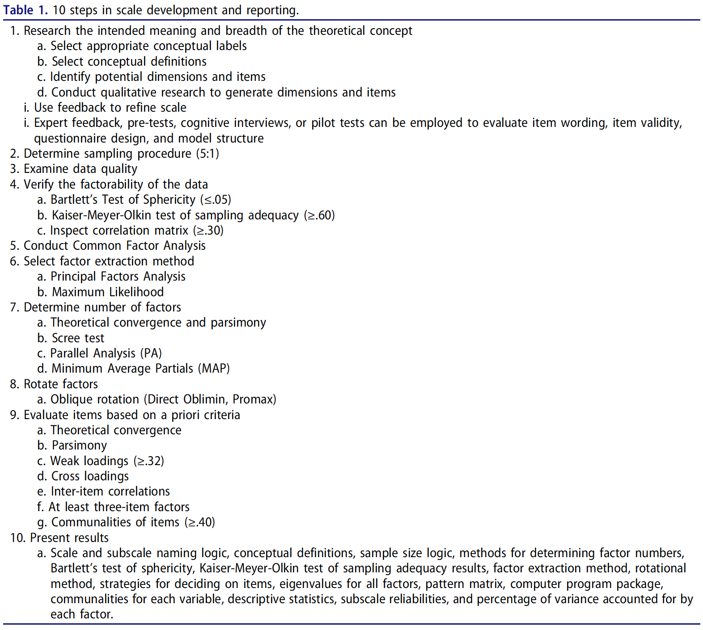{fig-align="center"}

# Workshop: Operationalization and Measurement

## This Workshop

-   Pick one of your dependent variables
-   Write a definition
-   Come up with 25-30 items based on that definition of how you would measure that construct
-   Now find and existing scale and compare!

## Phrasing items and questions {.smaller}

General Guidelines

-   Language is simple, straightforward, and appropriate for reading level
-   Ask about one (and ONLY one) issue
    -   Avoid double-barreled
-   Questions should not be LOADED (leading)
-   Avoid using emotionally charged language
-   Avoid double negatives
-   Avoid trendy expressions-
-   Avoid items everyone or no one will endorse
-   Avoid mixing items that assess behaviors with items that assess affective responses
    -   Ex: My boss is hardworking vs I respect my boss
